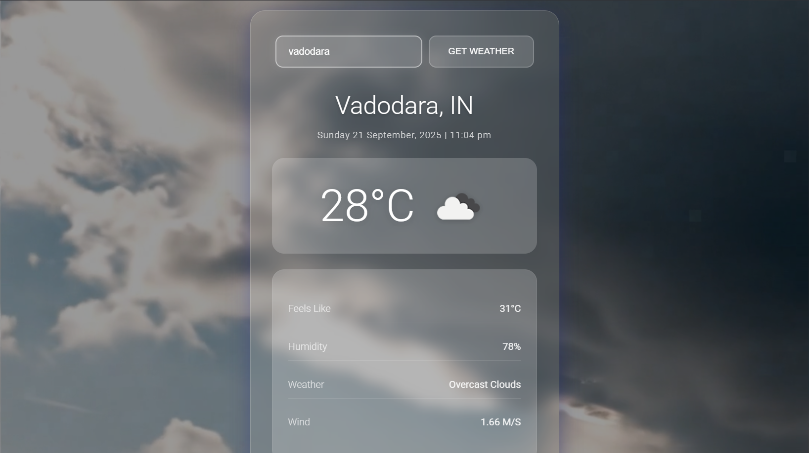

# ⛅ Weather App

A fast and responsive frontend weather application that fetches real-time weather data from a public Weather API. Built with React and Vite, it supports searching by city, geolocation-based weather, unit toggling (°C).

<div align="center">
  


  
</div>

**🔗 Live Demo:** [Weather-App](https://weatherapp-hkp.netlify.app/)

---

## 🌟 Features

- 🔍 City search with debounced input
- 📍 Use current location (Geolocation API)
- 🖼️ Dynamic weather icons and background states
---

## 🧰 Tech Stack

- React 18 + Vite
- CSS Modules or plain CSS
- Fetch API or Axios
- OpenWeatherMap API (Current + Forecast)

---

## 🚀 Getting Started

### Prerequisites
- Node.js 16+ and npm 8+ (or pnpm/yarn)
- An API Key from OpenWeatherMap (free): create at https://home.openweathermap.org/users/sign_up

### 1) Clone and install
```bash
git clone https://github.com/your-username/weather-app.git
cd weather-app
npm install
```

### 2) Environment variables
Create a `.env` file in the project root:

```env
# Vite requires variables to start with VITE_
VITE_WEATHER_API_KEY=YOUR_OPENWEATHER_API_KEY
```

### 3) Run the app
```bash
npm run dev
```
Open the local URL printed in your terminal (usually http://localhost:5173).

### 4) Build for production
```bash
npm run build
npm run preview
```

---

---

## 🖼️ Screenshots

<p align="center">
  
</p>

<p align="center">
  
</p>

---
